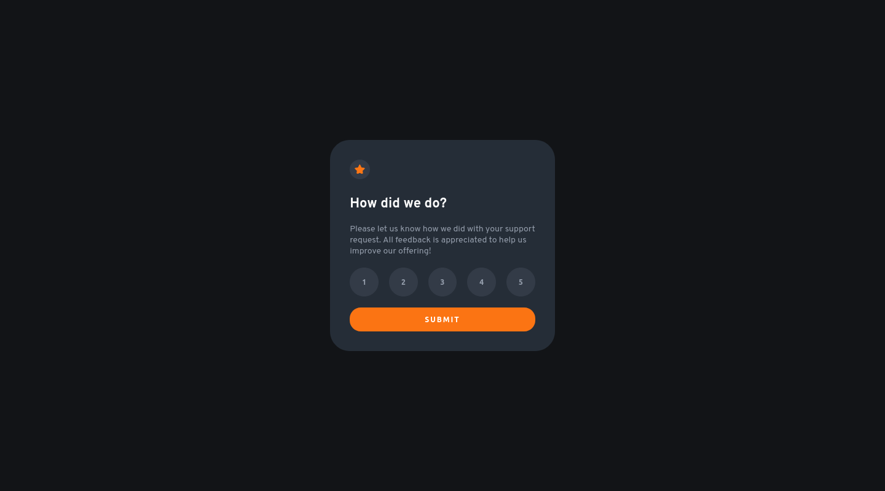

# Frontend Mentor - Interactive rating component solution

Essa é a solução para o [Interactive rating component challenge on Frontend Mentor](https://www.frontendmentor.io/challenges/interactive-rating-component-koxpeBUmI). Os desafios do Frontend Mentor ajudam você a melhorar suas habilidades de codificação criando projetos realistas. 

## Índice

- [Frontend Mentor - Interactive rating component solution](#frontend-mentor---interactive-rating-component-solution)
  - [Índice](#índice)
  - [Visão geral](#visão-geral)
    - [Challenge](#challenge)
    - [Screenshot](#screenshot)
    - [Links](#links)
  - [Meu processo](#meu-processo)
    - [Construído com](#construído-com)
  - [Author](#author)

## Visão geral

### Challenge

Seu desafio é construir esse componente de classificação interativo e fazê-lo parecer o mais próximo possível do design.

Os usuários devem ser capazes de:

- Selecione e envie uma classificação numérica
- Ver o estado do cartão "Obrigado" após enviar uma avaliação
- Visualize o layout ideal para o aplicativo, dependendo do tamanho da tela do dispositivo
- Veja os estados de foco para todos os elementos interativos na página

### Screenshot

   

### Links

- Clique no [link](https://github.com/eliseuSousa/interactive-rating-component) para acessar o repositório com a solução.
  
- URL do site: [Interactive rating component solution](https://eliseusousa.github.io/interactive-rating-component/)

## Meu processo
### Construído com
- Html
- CSS
- JavaScript

## Author

- Website - [Eliseu Sousa](http://eliseusousa.surge.sh/)
- Frontend Mentor - [@eliseuSousa](https://www.frontendmentor.io/profile/eliseuSousa)

